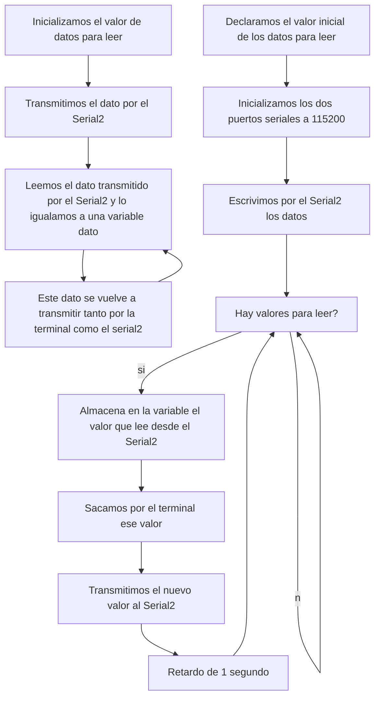

# Procesadores Digitales - Práctica 8

## Objetivo
El objetivo de esta práctica consiste en saber utilizar y comprender el funcionamiento de la comunicación usart, es decir, la capacidad de efectuar una comunicación asíncrona full duplex emisor y receptor simultanea, gracias a los modulos internos del procesador esp32.

## Software de arduino (funciones básicas)

- ``if(Serial)``: indica si el puerto serial está listo, retornando un true o un false
```cpp
while (!Serial) {
    // wait for serial port to connect. Needed for native USB
  } 
```
- ``available()``: da el numero de bytes pendientes para leer del puerto del terminal
```cpp
 if (Serial.available() > 0) {
    // hace algo
  }
```
- ``availableForWrite()``: ofrece el número de bytes disponibles para escribir

```cpp
Serial.availableForWrite() 
```

- ``begin()``: se utiliza para dar la velocidad de bits por segundo
```cpp
Serial.begin(speed) 
``` 
- ``end()``: desactiva la comunicación serie

```cpp
Serial.end()
``` 

- ``find()``: lee los datos del serial buffer hasta que encuentra el objetivo, devolviendo un true o un false
```cpp
Serial.find(target)
``` 
- ``findUntil()``: consiste en un bool que nos devuelve si el objetivo ya de tamaño o terminación de string es encontrado
```cpp
if(Serial.findUntil(target, terminal)){
  // algo
}
```
- ``flush()``: espera hasta que no se realiza la transmisón completa de los datos

```cpp
Serial.flush()
```
- ``parseFloat()``: devuelve el primer valor del serial buffer, con un float

```cpp
Serial.parseFloat()
```
- ``println()``: imprime datos en el puerto serie como texto ASCII legible por humanos seguido de un carácter de retorno de carro
```cpp
Serial.println(analogValue); 
```
- ``read()``: lee los datos transmitidos por el serial 
```cpp
Serial.read() 
```
- ``readBytes()``: lee caracteres del puerto serie en un búfer
```cpp
Serial.readBytes(buffer, length) 
```

- ``setTimeout()``: establece el máximo de milisegundos para esperar datos en serie
```cpp
Serial.setTimeout(time) 
```
- ``write()``: escribe datos binarios en el puerto serie
```cpp
Serial.write(val)
```

## Bucle de comunicación uart2
En esta parte de la practica tenemos que desarrollar una comunicación en bucle de la terminal rxd0 con la txd2, de forma que los datos obtenidos por la rxd2 se vuelvan a enviar a los rxd0 y viceversa. Para ello solo requeriremos de un solo ESP32.

En primer lugar, para el buen funcionamiento del programa necesitamos incluir dos librerías:

- ```#include <Arduino.h>```, nos proporciona el acceso de los tipos y constantes del lenguaje Arduino

- ```#include <HardwareSerial.h>```, esta libreria es requerida para poder realizar la comunicacion entre los diferentes puertos seriales del ESP32.

Después declaramos la variable dato, que se irá transmitiendo por los diferentes puertos.

```cpp
uint8_t dato=1;
```

A contuación, desarrollamos nuestro ``setup()``. Allí inicializamos a una velocidad de ``115200`` ambos puertos y transmitimos el valor que hemos declarado antes (`dato`) por el segundo puerto serie (``Serial2``).

```cpp
void setup() {
  // put your setup code here, to run once:
  Serial.begin(115200);
  Serial2.begin(115200);
  Serial2.write(dato);
}
```

Una vez hecho esto, ya podemos realizar el bucle `loop()` para que nuestro dato se vaya transmitiendo por las diferentes entradas y salidas. Primero, comprobamos si ``Serial2`` tiene datos disponibles para leer. Si es el caso, almacena en la variable ``dato`` un byte del puerto Serial2. Por el terminal del Serial, imprimimos el valor de `dato` y luego, se transmite este valor a través del puerto Serial2, enviando el byte de vuelta al dispositivo conectado al puerto Serial2. Por último, espera 1000 ms antes de verificar si hay más datos disponibles para leer.

```cpp
if(Serial2.available() > 0){
  dato = Serial2.read();
  Serial.println(dato);
  Serial2.write(dato); 
delay(1000);
}
```
Cuando juntamos todo el código, nos queda de esta forma:

```cpp  

#include <Arduino.h>
#include <HardwareSerial.h>

uint8_t dato=1;

void setup() {
  // put your setup code here, to run once:
  Serial.begin(115200);
  Serial2.begin(115200);
  Serial2.write(dato);
}

void loop() {
  // put your main code here, to run repeatedly:
  if(Serial2.available() > 0){
    dato = Serial2.read();
    Serial.println(dato);
    Serial2.write(dato); 
  delay(1000);
  }
}

```

### Diagrama de flujo

