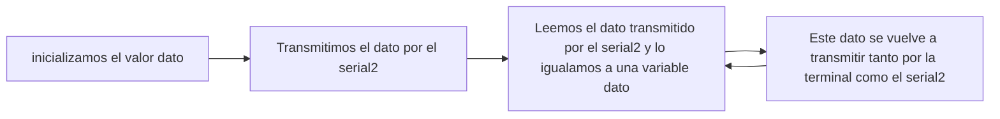

#Procesadores Digitales - Práctica 8

###Objetivo
El objetivo de esta práctica consiste en saber utilizar y comprender el funcionamiento de la comunicació  asincroa Usart. És decir la capacidad de efectuar una comunicación asincrona full duplex emisor y receptor simultanea, gracias a los modulos internos del procesador.

###Software de arduino

- if(Serial)
 Indica si el serial port está listo, retornando un true o false
```cpp
while (!Serial) {
    // wait for serial port to connect. Needed for native USB
  } 
```
- available()
Da el numero de bytes pendientes para leer del port
```cpp
 if (Serial.available() > 0) {
    // hace algo
  }
```
- availableForWrite()
ofrece el número de bytes disponibles para escribir

```cpp
Serial.availableForWrite() 
```

- begin()
Se utiliza para dar la velocidad de bits por segundo
```cpp
Serial.begin(speed) 
``` 
- end()
Desactiva la comunicación serie

```cpp
Serial.end()
``` 

- find()
Lee los datos del serial buffer hasta que encuentra el objetivo, devolviendo un true o flase
```cpp
Serial.find(target)
``` 
- findUntil()
Consiste en un bool que nos devuelve si el objetivo ya de tamaño o terminacion de string es encontrado
```cpp
if(Serial.findUntil(target, terminal)){
  // algo
}
```
- flush()
Espera hasta que no se realiza la transmisón completa de los datos

```cpp
Serial.flush()
```
- parseFloat()
devuelve el primer valor del serial buffer, con un float

```cpp
Serial.parseFloat()
```
- println()

Imprime datos en el puerto serie como texto ASCII legible por humanos seguido de un carácter de retorno de carro
```cpp
Serial.println(analogValue); 
```
- read()
lee los datos transmitidos por el serial 
```cpp
Serial.read() 
```
- readBytes()
lee caracteres del puerto serie en un búfer
```cpp
Serial.readBytes(buffer, length) 
```

- setTimeout()
establece el máximo de milisegundos para esperar datos en serie
```cpp
Serial.setTimeout(time) 
```
- write()
Escribe datos binarios en el puerto serie
```cpp
Serial.write(val)
```

###Ejercicio practico 1 bucle de comunicacion uart2
En esta parte de la practica tenemos que desarrollar una comunicacion en bucle de la terminal rxd0 con la txd2, de forma que los datos obtenidos por la rxd2 se vuelvan a enviar a los rxd0 y viceversa. Para ello solo requeriremos de una ESP32.

En primer lugar, para el buen funcionamiento del programa necesitamos incluir dos librerias:

- ```#include <Arduino.h>```, nos proporciona el acceso de los tipos y constantes del lenguaje Arduino

- ```#include <HardwareSerial.h>```, esta libreria es requerida para poder realizar la comunicacion entre los diferentes puertos seriales del ESP32.

Después declaramos la variable dato, que se ira transmitiendo por los diferentes puertos serial.

```cpp
uint8_t dato=1;
```

A contuacion desarrollamos nuestro setup. En el ponemos los dos serial a una velocidad de 115200 y transmitimos el dato ```dato``` por el serial2.

```cpp
void setup() {
  // put your setup code here, to run once:
  Serial.begin(115200);
  Serial2.begin(115200);
  Serial2.write(dato);
}
```

Una vez hecho esto, ya podemos realizar nuestro loop para que nuestro dato se vaya transimtiendo por las diferentes entrdas y saldas. Primero comrpovamos que nuestro serial2 tengo un dato al que enviar. Si es el caso, este dato lo recivimos por el mismo Serial2 y lo igualamos a una variable, la cual saldra por pantalla. Por ultimo este dato se vuelve a transmitir por el serial2 y espera 1000 ms.

```cpp
void loop() {
  // put your main code here, to run repeatedly:
  if(Serial2.available() > 0){
    dato = Serial2.read();
    Serial.println(dato);
    Serial2.write(dato); 
  delay(1000);
  }
```
Cuando juntamos todo el código, nos queda de esta forma:

```cpp  

#include <Arduino.h>
#include <HardwareSerial.h>

uint8_t dato=1;

void setup() {
  // put your setup code here, to run once:
  Serial.begin(115200);
  Serial2.begin(115200);
  Serial2.write(dato);
}

void loop() {
  // put your main code here, to run repeatedly:
  if(Serial2.available() > 0){
    dato = Serial2.read();
    Serial.println(dato);
    Serial2.write(dato); 
  delay(1000);
  }
}

```

### Diagrama de flujo

